<div align="center">

<a href="promo/hf_marketing.mp4">
  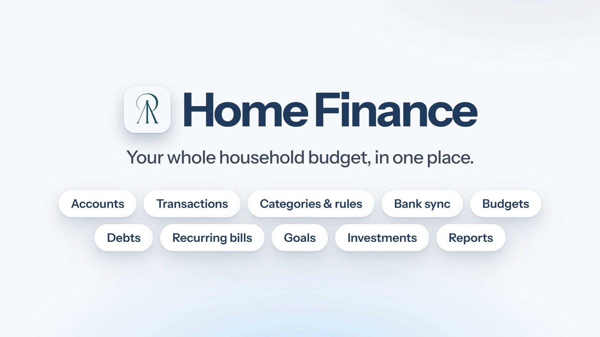
</a>

<br>

# Home Finance

**Your finances, in one place. On your own server, with a private login for everyone in your home.**

Accounts, budgets, debts, goals, bank sync, investments and an AI advisor in one self-hosted app.<br>
One Docker container. One SQLite file. No subscription, no third party reading your statements.

<br>

[](https://github.com/Lefyd24/HomeFinance/actions/workflows/ci.yml)
[](https://github.com/Lefyd24/HomeFinance/releases)
[](docs/security.md)
[](docs/getting-started.md)
[](docs/development.md)
[](docs/development.md)
[](docs/operations.md)
[](LICENSE)

[**Website**](https://lefyd24.github.io/HomeFinance/) &nbsp;·&nbsp; [**Get started**](docs/getting-started.md) &nbsp;·&nbsp; [**Watch the demo**](promo/hf_marketing.mp4) &nbsp;·&nbsp; [**Documentation**](docs/README.md) &nbsp;·&nbsp; [**Security & privacy**](docs/security.md)

</div>

<br>

## Why Home Finance?

Most finance apps want your bank login, a monthly fee and a copy of your data. Home Finance is built the other way round: it's a normal progressive web app (PWA) you open from your phone or laptop, but the data lives in a **plain SQLite file on a machine you control**.

- 🏠 **One server, a private space for each person.** Invite the people you live with and each gets their own login, accounts, transactions and budgets. Data is never shared between users (there are no joint accounts or combined household view), and admins can't see anyone else's finances.
- 🔒 **Private by default.** Nothing phones home. Every outside connection is optional and documented line by line in [Security & privacy](docs/security.md).
- 🪶 **Simple to run.** One container, one port, one folder to back up.
- 🧮 **Honest numbers.** Reports and calculators are deterministic math. The AI advisor looks up your real data and is never allowed to do arithmetic itself.
- 🌍 **English and Greek**, light and dark themes, installable as a PWA.

<br>

## See it in action

<div align="center">
<a href="promo/hf_marketing.mp4"><b>▶ Watch the demo</b></a>
</div>

<br>

<table>
  <tr>
    <td width="50%">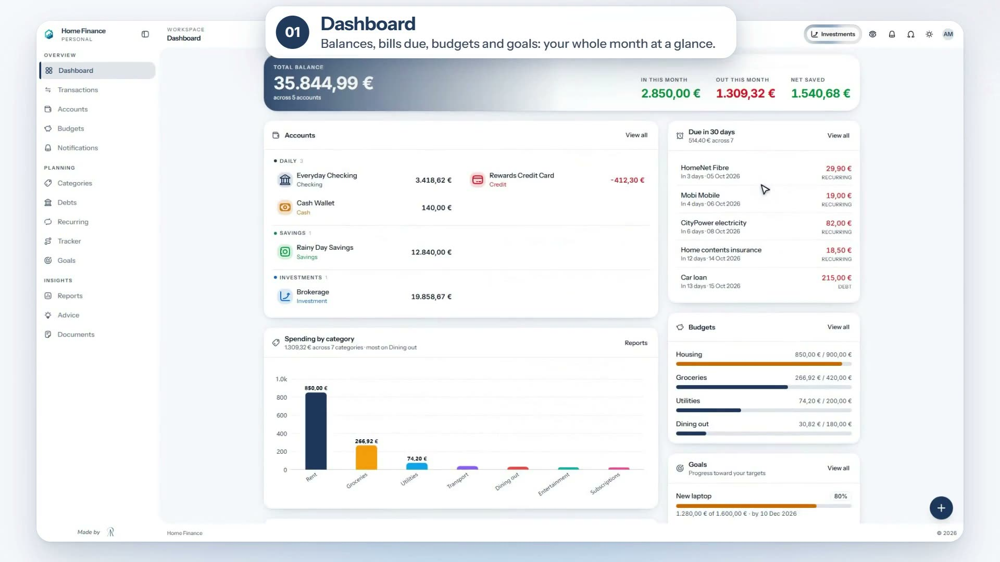<br><sub><b>Dashboard</b> · balances, bills due, budgets and goals at a glance</sub></td>
    <td width="50%">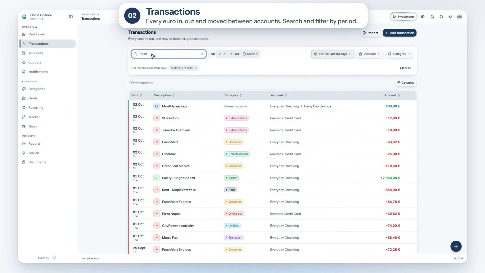<br><sub><b>Transactions</b> · search, filter, split and transfer</sub></td>
  </tr>
  <tr>
    <td width="50%">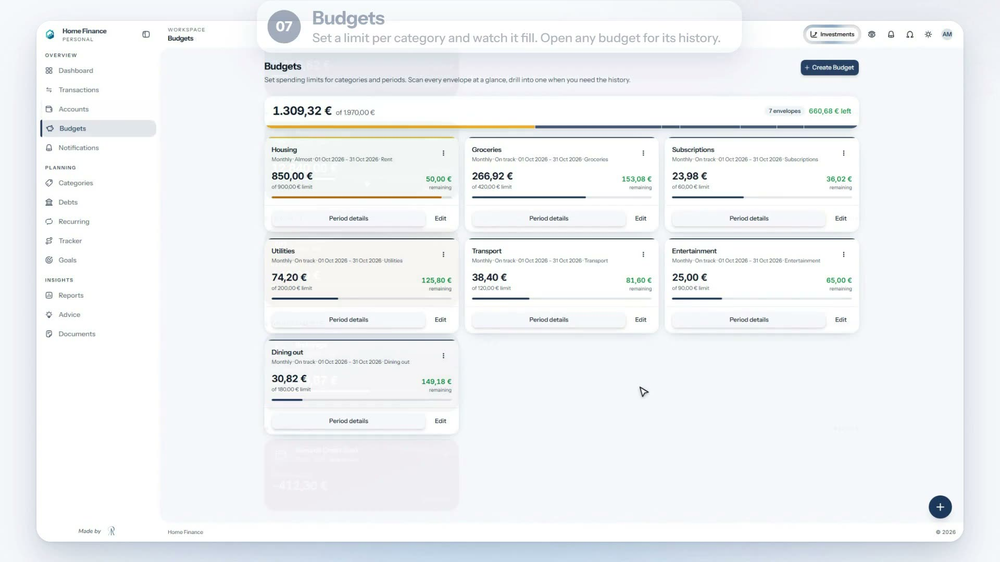<br><sub><b>Budgets</b> · a limit per category, with progress as you spend</sub></td>
    <td width="50%">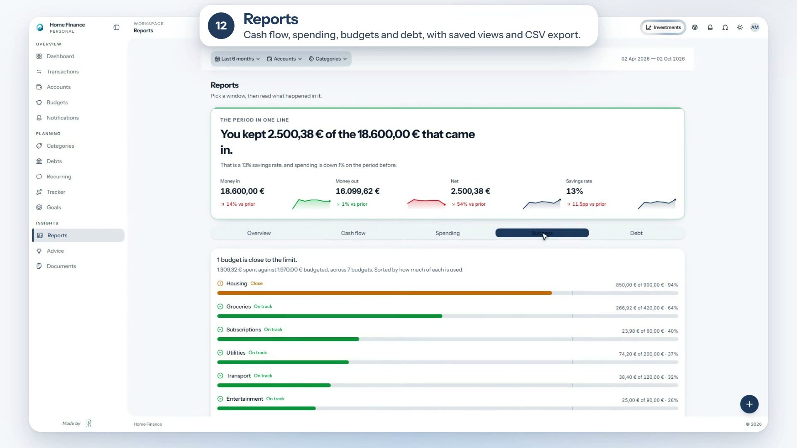<br><sub><b>Reports</b> · cash flow, spending, budgets and debt, with saved views</sub></td>
  </tr>
  <tr>
    <td width="50%">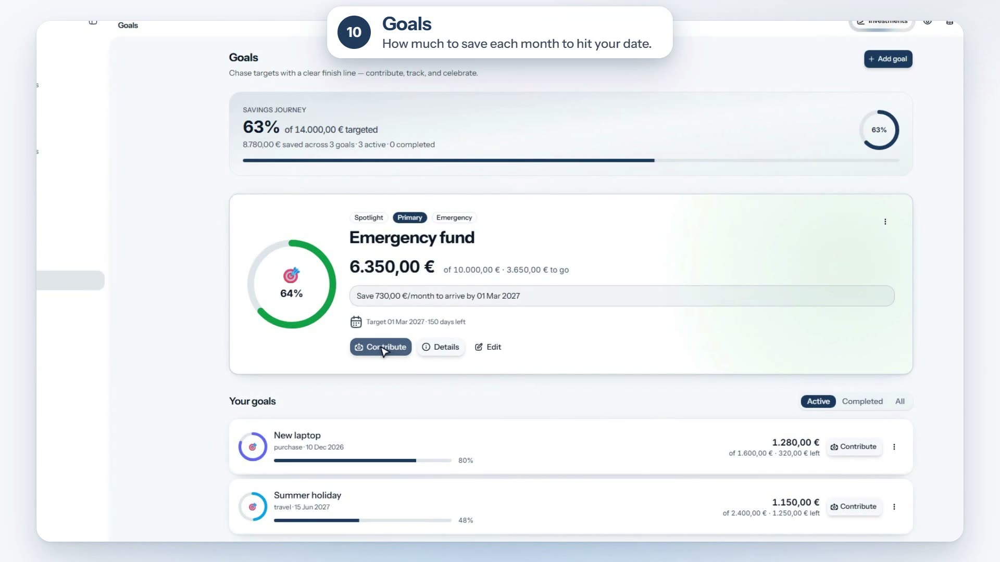<br><sub><b>Goals</b> · how much to save each month to hit your date</sub></td>
    <td width="50%">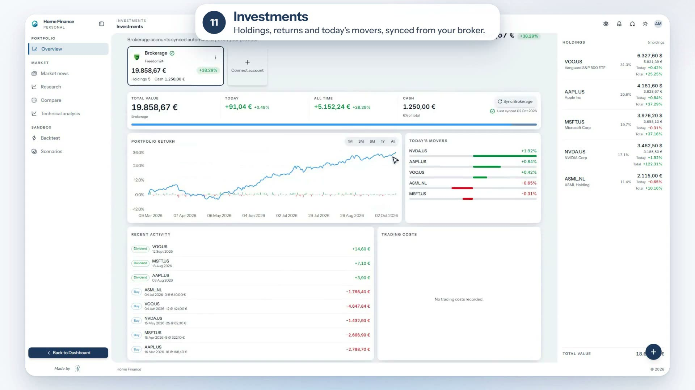<br><sub><b>Investments</b> · holdings, returns and movers, synced from your broker</sub></td>
  </tr>
</table>

<details>
<summary><b>More screens</b></summary>
<br>
<table>
  <tr>
    <td width="50%">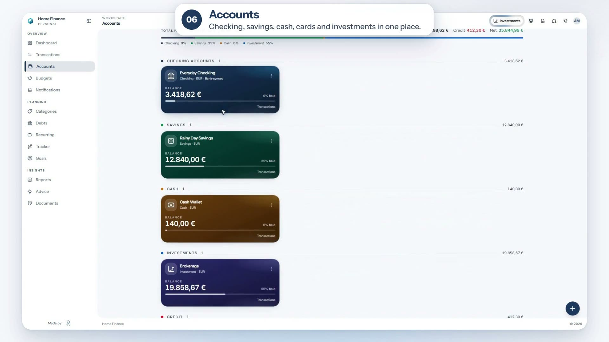<br><sub><b>Accounts</b> · checking, savings, cards, cash and investments</sub></td>
    <td width="50%">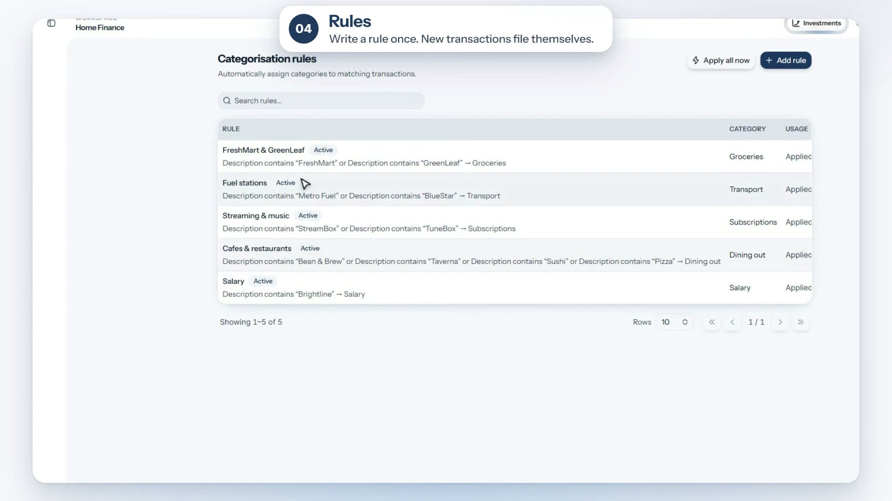<br><sub><b>Rules</b> · write a rule once, transactions file themselves</sub></td>
  </tr>
  <tr>
    <td width="50%">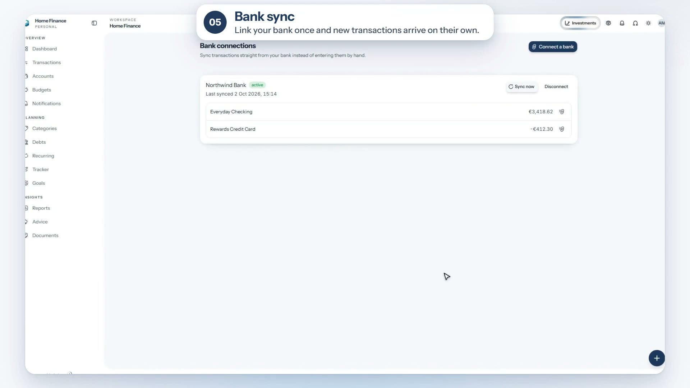<br><sub><b>Bank sync</b> · link your bank once, transactions arrive on their own</sub></td>
    <td width="50%">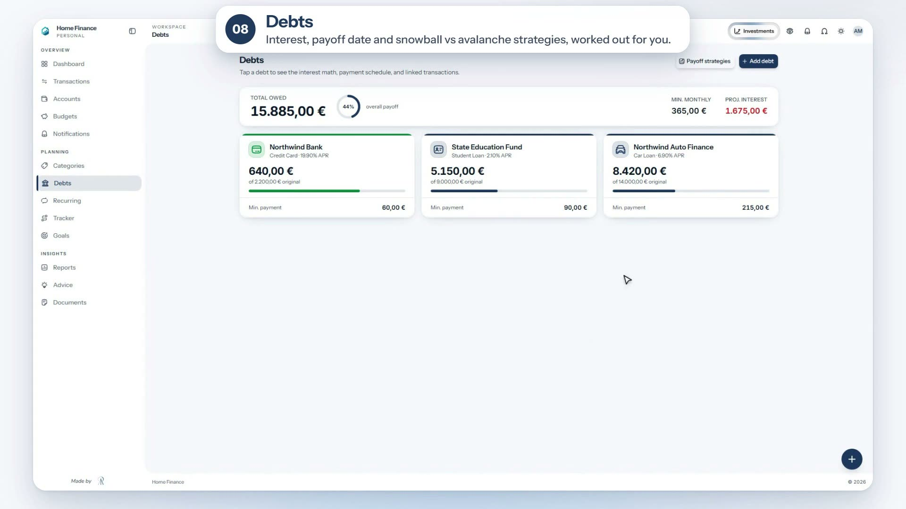<br><sub><b>Debts</b> · payoff dates, snowball vs avalanche</sub></td>
  </tr>
  <tr>
    <td width="50%">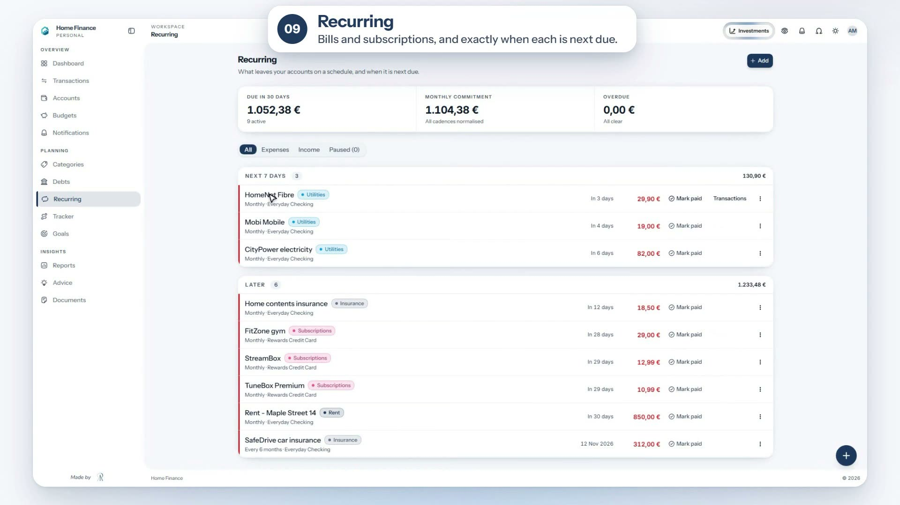<br><sub><b>Recurring</b> · bills and subscriptions, and when each is next due</sub></td>
    <td width="50%"></td>
  </tr>
</table>
</details>

> Screenshots show demo data.

<br>

## Features

### Know where the money goes

| | |
|---|---|
| **Accounts & transactions** | Checking, savings, credit, cash and investment accounts. Income, expenses and transfers, with split, bulk edit and transfer pairing. |
| **Categories & rules** | Colour-coded categories and "if the description contains X, use category Y" rules that categorize every future import and synced transaction automatically. |
| **Reports** | Overview, cash flow, spending, budgets and debt tabs with a shared filter bar, saved views, scheduled report emails and CSV export. |
| **Dashboard** | Cash flow, net worth, spending by category, bills due and goals on one screen. |
| **Documents** | Attach receipts and statements to your records, organized in folders with in-app preview. |

### Plan ahead

| | |
|---|---|
| **Budgets** | Limits per category and period, with progress bars and threshold alerts. |
| **Recurring bills** | Subscriptions and bills with their schedule, what's due next, and reminders. |
| **Goals** | Savings targets with the monthly amount needed and an on-track check against your real saving. |
| **Debts** | Loans and cards with payments and payoff dates, plus snowball vs avalanche strategy comparison. |
| **Calculators** | Compound growth, retirement, loan amortization, refinance, emergency fund and net-worth projections. Plain math, no external service. |

### Connect and automate

| | |
|---|---|
| **Bank sync** | Link European banks through [Enable Banking](https://enablebanking.com) (PSD2, read-only). Nightly sync, de-duplication, automatic categorization and consent-expiry reminders. → [Setup guide](docs/bank-sync.md) |
| **Investments** | Sync **Freedom24** and **Binance** (more are coming!). Portfolio analytics, ticker comparison, backtesting, technical analysis and company research. → [Guide](docs/investments.md) |
| **Notifications** | Email and desktop push for bills, low balances and budget thresholds, with quiet hours and de-duplication. → [Guide](docs/notifications.md) |
| **Trackers** | Follow spending on a project like a trip or a renovation, across accounts and categories. |

### Ask your money questions

An optional **AI advisor** answers questions such as *"how much did I spend on groceries last month?"* or *"should I pay off the car loan or invest the money?"* It reads your real transactions, budgets, debts, goals and portfolio through tools before it answers, and:

- **never does the arithmetic itself.** Every figure comes from a deterministic calculation on the server,
- **never predicts a price,** and states the main risk and what would make its advice wrong,
- respects the limits in your **investor profile**, and shows every profile change with a one-click undo,
- lets you **choose any tool-capable model** from OpenRouter, shows the **cost of every answer**, and enforces per-answer and monthly caps,
- offers guided workflows by slash command: `/review`, `/portfolio`, `/research`, `/opportunities`, `/email`, `/web`.

It's off until you add an API key. → [AI advisor guide](docs/ai-advisor.md)

> Home Finance is a personal tool. Nothing in it, including the AI advisor, is financial, tax or legal advice.

<br>

## Quick start

You need Docker with Compose, and `openssl`. The prebuilt image supports **amd64 and arm64**, so it runs on a PC, a server or a Raspberry Pi.

```bash
git clone https://github.com/Lefyd24/HomeFinance.git
cd HomeFinance
cp .env.example .env
```

Generate two secrets (`openssl rand -hex 32`, twice) and put them in `.env`:

```dotenv
SECRET_KEY=<first value>
NOTIFICATION_ENCRYPTION_KEY=<second value>

# Shown on the public Privacy and Terms pages
LEGAL_OPERATOR_NAME=Your Name
LEGAL_CONTACT_EMAIL=you@example.com
LEGAL_JURISDICTION=Your Country
```

Start it and create your admin account:

```bash
docker compose up -d        # pulls the prebuilt image from ghcr.io

docker compose run --rm -v "$PWD/scripts:/app/scripts:ro" \
  app python /app/scripts/create_admin.py you@example.com 'a-strong-password' "Your Name"
```

Open **http://localhost:8223** and sign in. Then invite other people from **Admin → Invite Codes**. Each person you invite gets their own separate, private data.

That's it. Your data is in `./data`. The full walkthrough is in [Getting started](docs/getting-started.md).

**Updating:** read the [release notes](https://github.com/Lefyd24/HomeFinance/releases), back up, then `docker compose pull && docker compose up -d`. Pin a version with `PF_IMAGE_TAG=1.0.0` in `.env`. Details in [Operations](docs/operations.md#updating). Prefer building from source? Use `docker compose up --build -d`.

<br>

## Run it anywhere

The app listens on `127.0.0.1:8223` by default and has no TLS of its own, so you choose how to reach it:

- **[Tailscale Funnel or Serve](docs/deployment.md#option-a-tailscale-funnel-recommended)**: public or private HTTPS on your own `*.ts.net` name, with no open router ports. This is the setup the project is designed around.
- **[Any reverse proxy](docs/deployment.md#option-b-another-reverse-proxy)** such as Caddy, nginx or Traefik.
- **[systemd](docs/deployment.md#running-at-boot-with-systemd)** to bring it up at boot on a home server or Raspberry Pi.

<br>

## Documentation

| | |
|---|---|
| 🚀 **[Getting started](docs/getting-started.md)** | Install, first admin, first invite |
| 📖 **[User guide](docs/user-guide.md)** | Every feature explained |
| ⚙️ **[Configuration reference](docs/configuration.md)** | Every environment variable and startup check |
| 🌐 **[Deployment](docs/deployment.md)** | Tailscale, reverse proxies, systemd, production checklist |
| 🛠 **[Operations](docs/operations.md)** | Updates, backups and restore, logs, key rotation, troubleshooting |
| 🗄 **[Database migrations](docs/migrations.md)** | How Alembic runs and how to recover |
| 🏦 **[Bank connection](docs/bank-sync.md)** | Step-by-step Enable Banking setup |
| 🤖 **[AI advisor](docs/ai-advisor.md)** | OpenRouter, models, costs, tools, skills |
| 📈 **[Investments](docs/investments.md)** | Brokers, analytics, backtesting, research |
| 🔔 **[Notifications](docs/notifications.md)** | SMTP email and Web Push |
| 🔐 **[Security & privacy](docs/security.md)** | The security model and what leaves your server |
| 👩‍💻 **[Development](docs/development.md)** | Architecture, local setup, tests, contributing |
| 🏷 **[Releasing](docs/releasing.md)** · **[Changelog](CHANGELOG.md)** | How versions are published, and what changed in each |

Interactive API docs are served at `/docs` on your running instance.

<br>

## Your data, your server

Everything lives in plain folders next to `docker-compose.yml`:

| Folder | Contents |
|---|---|
| `./data` | SQLite database and uploaded documents |
| `./logs` | Application logs |
| `./secrets` | Optional bank-sync private key |

Backing up is copying those folders plus your `.env`. See [Operations → Backups](docs/operations.md#backups).

The only things that leave your server are the integrations you switch on yourself: the AI advisor (to OpenRouter and the model provider you pick), bank sync (to Enable Banking and your bank), broker sync, market data (Yahoo Finance) and your own SMTP server. [The full list is here.](docs/security.md#what-leaves-the-server-and-only-if-you-enable-it)

<br>

## Built with

| Layer | Stack |
|---|---|
| Frontend | React 19 · TypeScript · Vite · Tailwind CSS · Radix/shadcn · TanStack Query · ECharts · i18next |
| Backend | FastAPI · SQLAlchemy · SQLite · Alembic · APScheduler |
| Auth | JWT access and refresh tokens · invite-only registration · email verification · rate limiting |
| AI & data | OpenRouter · yfinance · scikit-learn · statsmodels |
| Packaging | One multi-stage Docker image · Docker Compose |

<br>

## Contributing

Issues and pull requests are welcome. Start with [Development](docs/development.md) for the architecture, local setup and test commands. CI runs the backend and frontend tests and a Docker build on every pull request. Please run `DEBUG=true uv run pytest backend/tests` and `npm run test && npm run build` in `frontend/app` first.

Found a security problem? Please don't open a public issue. See [Security & privacy](docs/security.md#reporting-a-vulnerability).

## License

Released under the [ISC License](LICENSE).

<br>

<div align="center">
<sub>Bank and broker names and logos shown in the interface belong to their respective owners and are used only to identify the institution. Home Finance is not affiliated with or endorsed by any of them.</sub>
</div>
